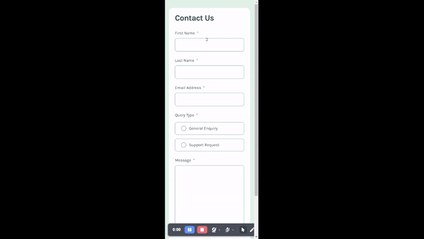
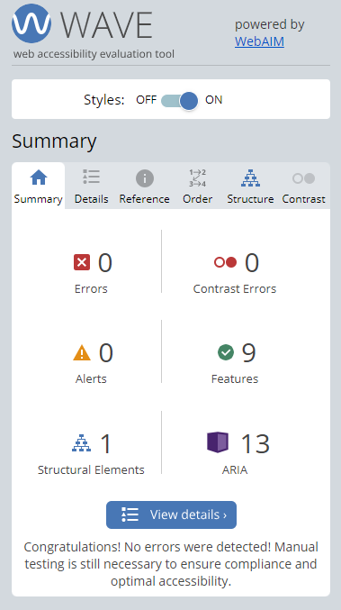
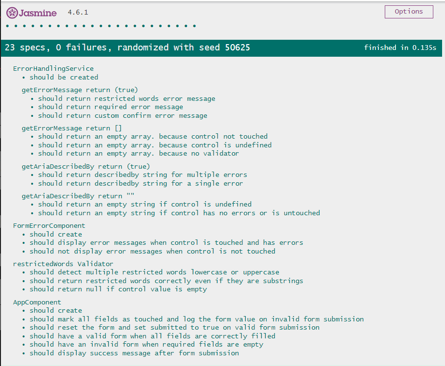
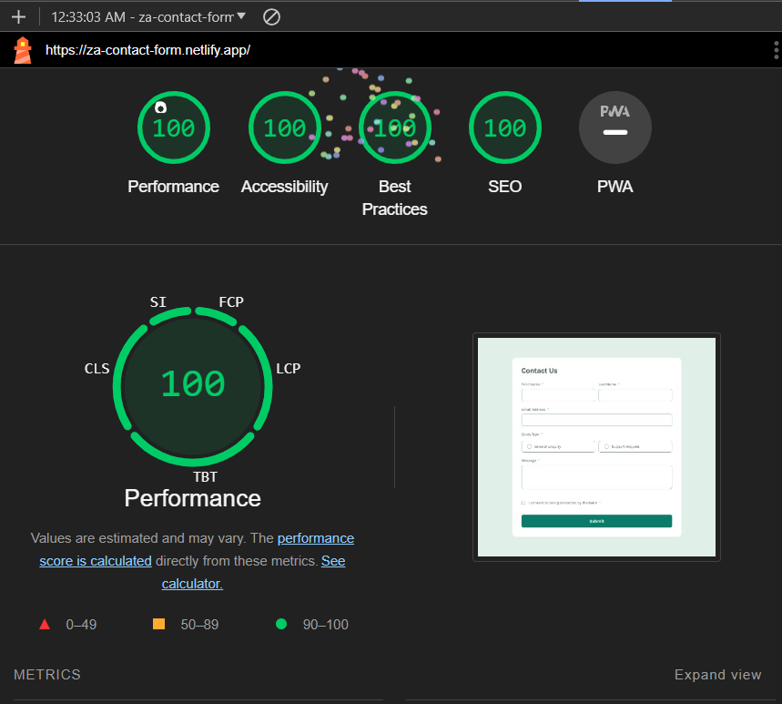

# Frontend Mentor - Contact form

This is a solution to the [Contact form challenge on Frontend Mentor](https://www.frontendmentor.io/challenges/contact-form--G-hYlqKJj). Frontend Mentor challenges help you improve your coding skills by building realistic projects.

## Overview

### Figma Design

<p align="center">

</p>

### Outcome

<p align="center">

</p>

## Technologies

The technologies used in this project are:

* HTML & Tailwind & TypeScript
* Angular (animation, reactive forms)
* Unit testing (Jasmine)

## Features

* Responsive Design: Ensures the form looks great on all devices.
* Form Validation: Real-time validation with meaningful error messages.
* Accessibility: Built with accessibility in mind, including ARIA roles and keyboard navigation.
* Animations: Smooth animations for form interactions.
* Unit testing: Comprehensive unit tests to ensure code reliability.

## Setup

To run this app in development mode open the terminal and write the following:

```shell  
git clone https://github.com/Zakaria9375/fm-contact-form.git 
cd fm-contact-form  
npm install 
 
# you need to install angular cli to run this app in development mode
npm install -g @angular/cli

ng serve
```

## Links

* [Challenge Page](https://www.frontendmentor.io/challenges/contact-form--G-hYlqKJj)
* [Live Demo](https://za-contact-form.netlify.app/)

## Testing

### Accessibility

This app has been built with care and attention to every detail to make it accessible to everyone So, you can expect the following:

* Zooming: No loss of content or functionality.
* Keyboard-only: Interactive elements are accessible(focusable and clickable).
* Static code analysis: No errors(using semantic HTML).
* Proper usage of aria rules.

<p align="center">

</p>

### Unit Testing

This project uses Jasmine and karma for unit testing

<p align="center">

</p>

To run and execute all the unit tests defined in the project after setting the app in development mode, open a new terminal and write the following:

```shell
ng test
```

### Lighthouse report

<p align="center">

</p>


## About the Author

* Portfolio - [Zakaria Ali](https://zaportfolio.netlify.app/)
* Frontend Mentor Profile - [@Zakaria9375](https://www.frontendmentor.io/profile/Zakaria9375)
* Project by - [Frontend Mentor team](https://www.frontendmentor.io/)

## Contributing

**Want to contribute?** *Great!* Here’s how you can help:

1. Fork the repo and create your branch from `main`.
2. Make your changes and test.
3. Issue that "pull" request!

## License

Copyright (c) 2024-present, Zakaria Ali
